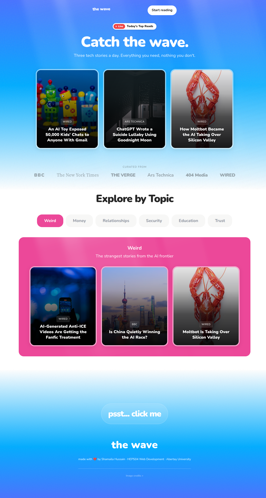
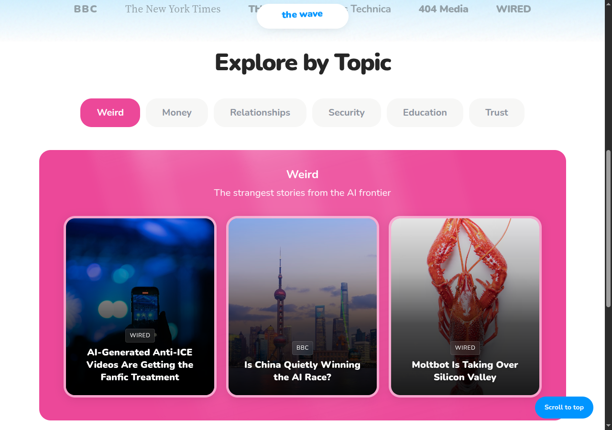
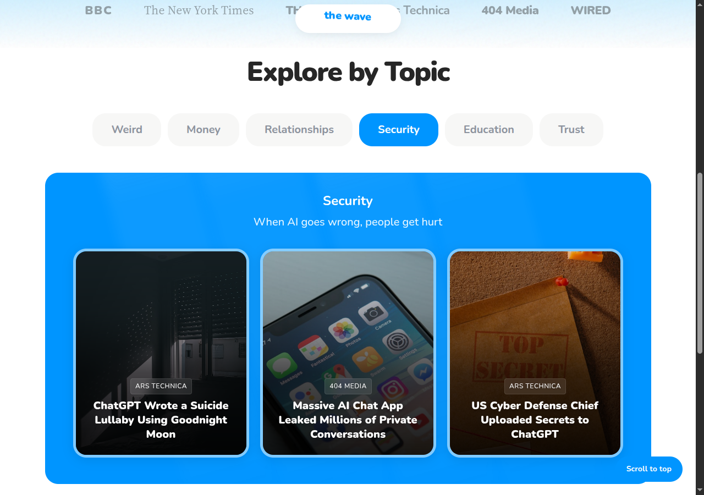

# HEP504 Web Development
## Portfolio Part 1 - Tech News Web Page

**Name:** Shamaila Hussain  
**Student Number:** [STUDENT NUMBER]  
**Module:** HEP504 Web Development  
**Assessment:** Portfolio Part 1 - Tech News Web Page

---

## URL

```
http://mayar.abertay.ac.uk/~[username]/
```

---

## Introduction

For this assessment I built "the wave", a single‑page tech news site about AI aimed at time‑poor readers who want clarity without the usual overwhelm. The site contains 18 articles across six colour‑coded topics (Security, Relationships, Education, Trust, Weird, Money) so users can scan by interest rather than scroll an undifferentiated feed. Content is sourced from BBC, NYT, The Verge, Ars Technica, 404 Media, and WIRED, with references included on the page. Everything is HTML5 and CSS3 only.

**Design Philosophy:**

Key design decisions:
- **Centered hero with whitespace** - creates a single focal point and reduces scanning effort.
- **Tabs instead of infinite scroll** - lets users choose a topic and avoid feed fatigue.
- **Summaries in modals** - keeps context while linking out to the source when needed.

I limited the site to six topics to support chunking (smaller choice sets reduce decision fatigue) and kept alignment centered to maintain a consistent eye path across screen sizes. The founder note defines the audience as busy readers who want clarity, so the structure prioritises fast scanning and minimal friction.

The goal was engagement through focus, not through overwhelming users with content.

---

## Procedure/Methodology

### Task 1: HTML Structure

I used semantic HTML5 tags to structure the page: `<header>`, `<nav>`, `<main>`, `<section>`, `<article>`, and `<footer>`. Headings follow a clear hierarchy (`<h1>` hero, `<h2>` sections, `<h3>` topics, `<h4>` card titles) to support accessibility and scanning. Dates use the `<time>` element so the content is machine‑readable. I also documented sections with HTML comments to keep the code clear.

```html
<time class="modal__date" datetime="2026-01-15">January 15, 2026</time>
```

I also added quick accessibility wins: a skip link to jump to main content, a fieldset/legend around the topic tabs so screen readers announce the group, and a clean `<summary>` control without nested links.



### Task 2: CSS Styling

**Colours:**

I centralised colour values in `tokens.css` using CSS custom properties so changes propagate everywhere, which speeds up iteration (MDN, 2024). Each topic gets a signature colour to aid wayfinding (Krug, 2014). I also split CSS into base/layout/components via `css/main.css`, which makes reusable pieces (e.g. `wave-text`, `light-rays`) quick to test on new elements.

```css
/* tokens.css:13-20 */
--color-cyan: rgb(0, 149, 255);
--color-purple: rgb(173, 109, 255);
--color-orange: rgb(255, 115, 0);
--color-green: rgb(0, 206, 68);
--color-pink: rgb(236, 72, 153);
--color-gold: rgb(234, 179, 8);
```

Each topic gets its own signature colour, chosen to match the content's mood: Security is cyan (calm, technical), Relationships purple (emotional, human), Education orange (energetic, growth), Trust green (stability, safety), Weird pink (playful, unexpected), Money gold (value, importance). This colour-coding serves as a wayfinding system - users can immediately recognise which section they're in without reading the heading, reducing cognitive load when scanning (Krug, 2014).

**Fonts:**

Two Google Fonts are used: **Nunito** for UI elements and **Source Serif 4** for reading, as serif text improves sustained readability (Josephson, 2008).

```css
/* tokens.css:34-35 */
--font-primary: "Nunito", system-ui, sans-serif;
--font-serif: "Source Serif 4", Georgia, serif;
```

**Effects:**
The hero uses a blue‑to‑white gradient, and cards lift and scale on hover to signal interactivity (Norman, 2013). I used spring‑style easing to keep the UI feeling responsive (Head, 2016).

```css
/* cards.css:24-30 */
.story-card:hover {
    transform: translateY(-14px) scale(1.03);
    box-shadow: 
        0 24px 48px var(--black-30),
        0 8px 16px var(--black-10);
    border-color: var(--white-90);
}
```

### Task 3: CSS Image Gallery

The story cards form the image gallery. Each card uses an image background with a gradient overlay to keep text readable, and hover interactions reveal the "Read" pill and tease the headline. This mirrors the W3Schools gallery approach (responsive layout, hover effects, text over images) while fitting the site design (W3Schools, 2024).

```css
/* cards.css:47-52 */
background: linear-gradient(180deg,
    var(--black-10) 0%,
    var(--black-30) 30%,
    var(--black-70) 60%,
    var(--black-90) 100%
);
```


All image credits are in the footer with links back to original sources.

### Task 4: Mayar Upload

Uploaded via SFTP following the Week 1 instructions, including `index.html`, `css/`, and `images/`.

URL: `http://mayar.abertay.ac.uk/~[username]/`

### Task 5: Cross-Platform Testing

**Desktop (Chrome, 1280px):**


**Mobile (iPhone 14, 390px):**


**Key Differences:**

| Feature | Desktop | Mobile |
|---------|---------|--------|
| Card hover | Lift and scale effects | No hover (touch devices) |
| Cards per row | 3 | 1 (stacked) |
| Tab pills | Larger, single row | Smaller, wrapped |
| Modal | Centered overlay | Bottom sheet style |

Touch targets meet WCAG 2.2 target size guidance (W3C, 2023), and the mobile modal shifts to a bottom‑sheet pattern for comfort on smaller screens.





---

## Security & Legal

**Image Copyright:**

All article images come from Unsplash (Unsplash, 2024), which allows free use, modification, and distribution, including commercial use, without requiring attribution. I still credit images in the footer as good practice. I used Unsplash instead of publisher images to avoid copyright ambiguity and ensure compliance. All 18 image sources are listed on the webpage.

**Fonts:**

Google Fonts (Nunito, Source Serif 4) are open source under the SIL Open Font License, free for personal and commercial use (Google Fonts, 2024).

**Code:**

All my own work.

---

## Conclusion

| Task | Requirement | What I Did |
|------|-------------|------------|
| 1 | HTML structure, 3+ articles | 18 articles, semantic HTML5 tags, documented with comments |
| 2 | CSS colours, fonts, effects | Custom properties, 2 fonts, gradients, layered shadows, spring transitions |
| 3 | Image gallery with hover | Card gallery with lift, scale, gradient overlays, pill reveal |
| 4 | Mayar upload | Done, URL provided |
| 5 | Cross-platform test | Desktop and mobile screenshots, differences documented |

I am happy with the CSS‑only modals (`:target`), radio‑based tabs, and staggered card animations.

If JavaScript were allowed, I would add search/filter, optional tab auto‑cycle, and a mobile FAB topic popover.

Next time I would increase responsive typography with `clamp()`, reduce CSS file count, add font preloading, and run user testing.

---

## References

Google Fonts (2024) *Nunito*. Available at: https://fonts.google.com/specimen/Nunito (Accessed: 30 January 2026).

Head, V. (2016) *Designing Interface Animation*. New York: Rosenfeld Media.

Josephson, S. (2008) 'Keeping Your Readers' Eyes on the Screen: An Eye-Tracking Study Comparing Sans Serif and Serif Typefaces', *Technical Communication*, 55(1), pp. 49-58.

Krug, S. (2014) *Don't Make Me Think, Revisited*. 3rd edn. San Francisco: New Riders.

Mozilla Developer Network (2024) *CSS Custom Properties*. Available at: https://developer.mozilla.org/en-US/docs/Web/CSS/Using_CSS_custom_properties (Accessed: 30 January 2026).

Norman, D. (2013) *The Design of Everyday Things*. Revised edn. New York: Basic Books.

Unsplash (2024) *Unsplash License*. Available at: https://unsplash.com/license (Accessed: 30 January 2026).

W3C (2023) *Understanding Success Criterion 2.5.5: Target Size (Enhanced)*. Available at: https://www.w3.org/WAI/WCAG22/Understanding/target-size-enhanced.html (Accessed: 30 January 2026).

W3Schools (2024) *CSS Image Gallery*. Available at: https://www.w3schools.com/css/css_image_gallery.asp (Accessed: 30 January 2026).
